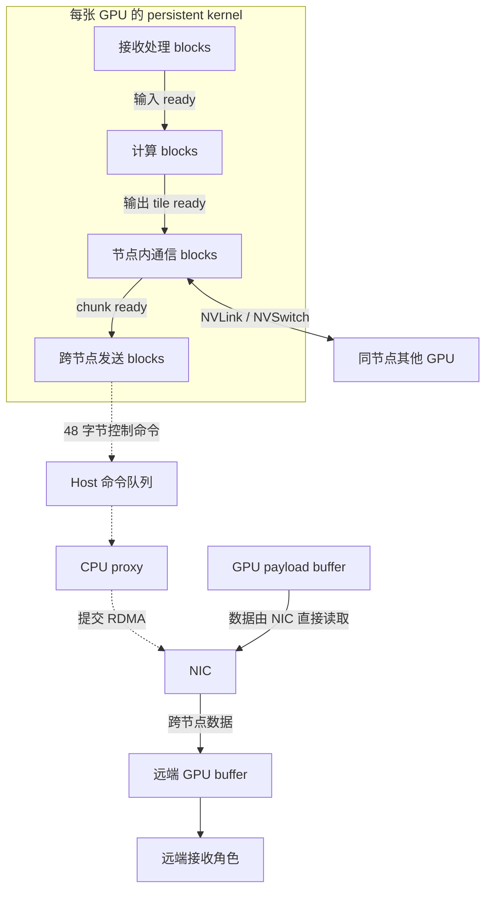
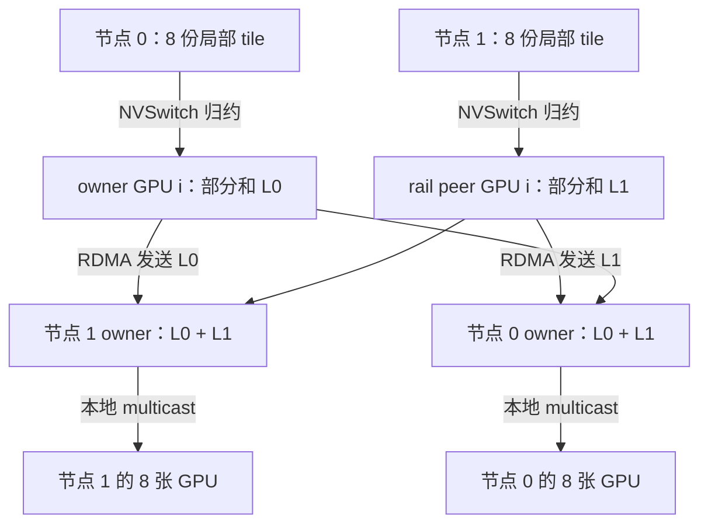

# mKernel：优化设计与收益原理

mKernel 把**计算、节点内 NVLink 通信、节点间 RDMA 通信放进同一个 persistent kernel 的调度过程**：计算得到的 tile 可以提前进入通信流水线，远端到达的输入也可以提前被计算消费。它再用分层通信减少慢速网络上的重复数据，用专门的通信 thread block 推进流水线，并按剩余工作动态调整计算与通信的资源分配。

阅读依据是 Ziming Mao 等人的 [《mKernel: Fast Multi-GPU, Multi-Node Fused Kernels》v1](https://arxiv.org/html/2609.13585v1)，发布于 2026-09-11。论文名称使用单数 **mKernel**。本笔记整理于 2026-09-27，面向熟悉 GPU kernel、TP／EP／SP 的读者。

::: tip 阅读路径
本页解释设计、motivation 和收益原理；[五类算子](./kernels.md)追踪实际的数据依赖；[性能与边界](./evaluation.md)核对基线与数字；[实现核对](./implementation.md)提供固定版本的源码入口。
:::

## 1. 它解决的等待发生在哪里

常规执行中，GEMM 结束后才启动 AllReduce；AllGather 全部完成后，GEMM 才能消费完整输入。即使采用双 stream 把工作拆成多个 chunk，某个 chunk 通常仍要等对应 producer kernel 结束才释放。这样，**数据已经局部就绪与下游开始使用之间仍然存在等待**。

已有节点内融合可以缩短第一层等待，但跨节点时多出一个更慢、接口不同的通信层。论文集群中每张 GPU 的 NVLink **单方向**带宽为 450 GB/s，跨节点为 50 GB/s，约相差 9 倍；跨节点链路的 400 Gb/s 除以 8 才得到 50 GB/s。两种数字不能直接与 NVLink 双方向的 900 GB/s 混比。[论文 §2.1，表 1](https://arxiv.org/html/2609.13585v1#S2.SS1)

节点内的 peer memory 操作可以针对一个小 tile；RDMA 则需要明确的地址、长度、提交请求和完成通知。直接把每个 tile 都变成一条网络请求，会放大提交与通知开销。延后到整块输出就绪，又会丢失融合的重叠机会。

| 优化设计 | Motivation：限制在哪里 | 实现抓手 | 收益原理与代价 |
|---|---|---|---|
| 三阶段 tile 级融合 | kernel 边界延迟释放数据，节点间通信留下尾部 | persistent kernel；显式 readiness；计算、节点内、发送、接收角色 | 重叠不同块的工作；付出轮询与同步开销 |
| NVSwitch 分层归约与广播 | 跨节点带宽约为节点内的 1/9 | 本地先归约、rail peer 间交换、接收后本地广播 | 减少慢链路上的重复字节；受拓扑和布局约束 |
| tile、chunk、提交 batch 分开选择 | 小消息固定成本高，大消息启动晚 | chunk 内计数；最后一个 tile 发布 ready；小批量提交 | 同时控制首发时刻和消息成本；粒度需要平衡 |
| SM specialization 与自适应分配 | 通信与 GEMM 争用 SM，最佳分配随 shape 和阶段变化 | block 角色分工；计时与进度计数；任务边界切换 | 减少资源错配和尾部空闲；通信占用 SM 也会拖慢计算 |
| GPU 发起、CPU proxy 提交 | 直接驱动 NIC 的硬件要求与逐 chunk 开销 | 48 字节命令队列；libibverbs；最多 8 条批量提交 | CPU 提交与 GPU 计算重叠，控制成本被摊薄；依赖 proxy 推进 |
| 按传输语义发布到达通知 | EFA 不保证独立 write 有序；旧 flag 可能被误读 | IB 的 data→flag；EFA 的完成事件；epoch 标记 | 在正确的最小依赖上放行计算，避免逐块全局同步 |

上表概括论文 §2–4。下面逐项解释因果关系；性能数字及证据限制集中在[性能页](./evaluation.md)。

## 2. 把整块依赖变成持续推进的流水线

Persistent kernel 让一组 thread block 留在 GPU 上持续领取任务。mKernel 依据 block 的角色安排计算、节点内通信、跨节点发送和接收处理。GPU 上的 readiness 状态让这些角色交换进度，CPU proxy 只处理网络命令，payload 由 NIC 直接读写 GPU 内存。[论文 §3，图 2](https://arxiv.org/html/2609.13585v1#S3)

图中实线表示数据或数据就绪依赖，虚线表示控制命令；发送与接收对应不同方向的工作，具体依赖随算子变化。一个 tile 内部的生产与消费仍有先后顺序，重叠发生在不同 tile 或不同阶段之间。

论文用下面的近似关系解释资源权衡：

$$
T_{\mathrm{fused}}\approx
\max\left(
T_{\mathrm{compute}}\frac{S}{S-S_c},
T_{\mathrm{NVLink}},
T_{\mathrm{network}}
\right)+T_{\mathrm{fill/drain}}+T_{\mathrm{sync}}.
$$

- $S$ 是全部 SM 数，$S_c$ 是分给通信的 SM 数。
- $T_{\mathrm{compute}}$ 是全 SM 用于计算时的耗时；这里假设计算吞吐近似随计算 SM 数线性变化。
- 两项通信时间也随资源分配变化；后两项是流水线填充／排空和同步成本。

优化有三条不同的作用路径：融合把各阶段的串行等待变成可重叠工作；分层通信直接减少 $T_{\mathrm{network}}$ 中需要搬运的字节；调度与粒度设计则控制资源竞争、填充和尾部。**它们不能简单相加成一个加速倍数**。当网络已经饱和，继续增加通信 SM 可能只会减少计算资源。[论文 §2.2，式 (1)](https://arxiv.org/html/2609.13585v1#S2.SS2)

## 3. 分层通信：把重复操作留在节点内

### GEMM + AllReduce 的数据归属

考虑论文的两个节点、每节点 8 张 GPU。每张 GPU 计算出一个局部输出 $C_{n,g}$，最终需要

$$
C=\sum_{n=0}^{1}\sum_{g=0}^{7} C_{n,g}.
$$

对某个输出 tile，先在节点内得到部分和 $L_n=\sum_g C_{n,g}$。每个节点把输出 tile 分给 8 张 GPU，某张 owner GPU 只负责其中 1/8。owner 通过 NVSwitch 归约本节点贡献，与另一节点相同本地 GPU 编号的 **rail peer** 交换部分和，合并后向本节点广播最终结果。每个 tile 可以独立推进。[论文 §3.1、表 3](https://arxiv.org/html/2609.13585v1#S3.SS1)

**收益推导。** 若完整输出为 $D$ 字节，两节点这一交换阶段中，每张 GPU 发送自己负责的约 $D/8$，一个节点合计发送 $D$。与“8 张 GPU 各自发送完整 $D$”这个冗余示例相比，节点发送量从 $8D$ 变成 $D$。这个 8 倍是对该示例的数据量推导，**不是相对 NCCL 的实测降幅**；NCCL 也可能使用分层 collective。

减少跨节点字节后，还要尽早发送。若先完成所有 tile 的本地归约再交换，分层通信仍会留下长尾。mKernel 将分层路径与逐 tile 就绪结合，使前面的 chunk 传输时，后面的 tile 继续计算与本地归约。

### AllGather 的对称思路

AllGather + GEMM 把同一个 shard 向每个目标节点发送一次，由接收 rail peer 在节点内广播。本地复制由带宽更高的 NVLink 承担，避免该 shard 为目标节点内的多个 GPU 重复跨网络传输。计算按“本 GPU shard → 本节点其他 shard → 远端 shard”的可用顺序推进，给远端通信留出重叠窗口。[论文 §3.1、§4](https://arxiv.org/html/2609.13585v1#S4)

## 4. 三种粒度分开控制

**计算 tile、网络 chunk、proxy 提交 batch 解决三个不同问题。** 计算 tile 适配矩阵运算与本地搬运；chunk 是有独立到达通知的一段网络数据；batch 只是一次向 NIC 提交多条命令，不要求把它们变成一个更大 payload。

| 粒度 | 何时就绪 | 论文示例 | 调大后的主要变化 |
|---|---|---|---|
| Tile | 本 tile 的计算或本地操作完成 | GEMM + AllReduce 的局部输出块 | 改变计算／本地访存组织 |
| Network chunk | 覆盖范围内的 tile 全部就绪 | 4 个 tile，合计 256 KiB | 减少消息数，但延后首发并增加尾部等待 |
| Submission batch | proxy 已收集到命令，或收集窗口到期 | 同连接最多 8 条，允许不足 8 条 | 摊薄提交成本；强等满批会拖慢稀疏与尾部流量 |

AllReduce 中，每个 chunk 有完成计数。各 tile 独立归约，最后完成的 tile 负责发布 chunk ready。发送角色只等待这一 chunk，其他输出无需完成。proxy 随后把已就绪命令批量提交，并保留每条命令的完成通知。[论文 §3.1、§3.3](https://arxiv.org/html/2609.13585v1#S3.SS3)

**简化推导。** 设数据总量为 $D$，chunk 大小为 $q$，每条消息固定开销为 $\alpha$，网络有效带宽为 $\beta$。串行服务的粗略成本可写为

$$
T_{\mathrm{transfer}}(q)\approx
\left\lceil\frac{D}{q}\right\rceil\alpha+\frac{D}{\beta}.
$$

这个式子只解释“小消息为什么贵”，没有模拟实际并发提交。真实完成时间还要加入凑齐 chunk 的等待、依赖、资源争用和排空成本。因此，仅最小化消息数会偏向过大的 chunk；仅追求最早发送又会偏向过小的 chunk。batch 在不增大 $q$ 的情况下减少提交调用次数，提供了另一种摊薄控制开销的办法。

接收端也必须处理粒度不一致。MoE Dispatch + GEMM 的网络 chunk 为 512 KiB；某个 token 的字节范围若横跨 chunk 边界，消费它之前要确认所有相交 chunk 都已到达。检查起始 chunk 会漏掉 token 后半段的数据依赖。[论文 §3.1](https://arxiv.org/html/2609.13585v1#S3.SS1)

## 5. SM 分工与自适应资源分配

### 为什么给通信更多 SM 也可能更慢

通信 SM 负责本地搬运、就绪检查、发送请求和到达处理；NIC 搬 payload 并不意味着网络路径完全不占 GPU 执行资源。固定分工让通信持续推进，也保持计算 block 原有的 warp 布局。

分配太少时，通信服务速度跟不上：输入型算子会让 GEMM 等数据，输出型算子会积累通信尾部。分配太多时，GEMM 可用 SM 减少。论文单节点扫描中，不同 workload 的最佳通信配置从 2 到 64 SM 不等；最差 AllReduce 配置的延迟约为最佳的 25 倍。这描述了**配置敏感性**，不能当成 mKernel 相对其他系统的 25 倍加速。[论文 §5.5，图 3](https://arxiv.org/html/2609.13585v1#S5.SS5)

### 控制器为什么按剩余工作分配

假设共有 $B$ 个可分配 block，其中 $n_s$ 个负责通信。剩余计算任务数为 $R_p$、平均单任务成本为 $C_p$；通信对应 $R_s,C_s$。若把各角色的剩余完成时间近似写成

$$
T_p\approx\frac{R_pC_p}{B-n_s},\qquad
T_s\approx\frac{R_sC_s}{n_s},
$$

令两者相等，就得到论文的目标分配：

$$
n_s^*=B\frac{R_sC_s}{R_pC_p+R_sC_s}.
$$

block 用 cycle counter 估计任务成本，控制器结合剩余任务更新共享目标。block 在 tile 或 message 等任务边界检查目标并切换角色；这是软件调度中的角色调整。控制器目标与瞬时实际分配可能不同，尚在执行的任务需要先结束。[论文 §3.2，式 (2)](https://arxiv.org/html/2609.13585v1#S3.SS2)

<SmAllocationDemo />

上面的交互只展示式 (2) 的均衡关系，数值为任意工作量单位。实际调度还受整数分配、任务依赖、最小执行资源和吞吐非线性影响。

对 GEMM + AllReduce，计算接近完成时，剩余工作主要是通信；动态分配可以把结束计算的资源转去清理尾部。对 Dispatch + GEMM，通信供给输入，等待输入的计算 block 可以临时协助通信，即使已达到控制器目标。这个依赖感知的处理避免把空等当作有用计算。[论文 §3.2、§5.5](https://arxiv.org/html/2609.13585v1#S5.SS5)

论文对自适应 SM 的实测限定在**单节点 8×H100**。跨节点性能表不能据此归因于已经验证的多节点自适应控制器。

## 6. GPU 发起通信，CPU proxy 提交请求

### 控制路径与 payload 路径

发送 block 将 48 字节命令写入 pinned host memory 中的 ring buffer。命令包含目标、源／目的 offset、字节数和 chunk 标识。先写命令正文，再提交 header，proxy 观察到提交后才读取完整记录。队列 credit 和未完成请求数上限形成背压，避免 GPU 把 host 或 NIC 队列塞满。

proxy 通过 libibverbs 提交 RDMA，NIC 从已注册的 GPU 内存读取 payload；若计算布局与网络布局不同，可以使用 GPU staging buffer。数据无需先复制到 CPU 内存。**GPU 决定什么时候有数据可发，CPU 负责把控制请求交给 NIC**，两者可以同时推进。[论文 §3.3](https://arxiv.org/html/2609.13585v1#S3.SS3)

### 为什么这里的 IBGDA 收益不大

作者在 ConnectX-7 上实现了同设备接口的 IBGDA 后端，对相同 kernel 作比较，观察到性能差异很小。论文解释是：proxy 提交可以被计算覆盖，并且可批量处理命令；IBGDA 路径逐 chunk 的 system-scoped GPU fence 和 doorbell 也有开销。[论文 §3.3，图 4](https://arxiv.org/html/2609.13585v1#S3.SS3)

这项结果支持“在论文测试的粒度和负载中，host-assisted GPU-initiated 通信具有竞争力”。对于小消息、强延迟敏感或 CPU proxy 成为瓶颈的场景，结论需要重新测量。它也没有否定 GPUDirect RDMA：proxy 路径本身就使用 NIC 与 GPU 内存之间的直接数据传输。

## 7. readiness 的正确性决定能否安全提前消费

整个流水线依赖三个时刻的区分：**GPU 已生产数据、网络请求已提交、远端数据可以被 GPU 安全消费**。只有最后一种状态允许接收计算继续。

| 路径 | 到达通知怎么产生 | 为什么能表示完成 | 仍需满足的条件 |
|---|---|---|---|
| InfiniBand RC | 同一连接先写 payload，再写 flag | 利用同连接写入的有序性 | 适用的传输顺序与 GPU 内存可见性 |
| EFA SRD 完成路径 | RDMA write with immediate；接收 proxy 收到完成事件后发布 flag | 完成事件关联本次 payload，immediate 标识 chunk | 正确处理完成、flag 发布及 GPU 可见性 |
| 跨次 kernel 执行 | ready／arrival flag 带 epoch | 区分本次与上一次的通知 | epoch、缓冲复用和在途请求的生命周期配合 |

SRD 不保证独立 write 按提交顺序到达，不能直接把 IB 的“两次 write”协议照搬过去。完成事件与 GPU 内存可见性又是两个层次；某个 fence、volatile 读取或 epoch 标记单独存在，都不能替代对整条 happens-before 关系的检查。[论文 §2.3、§3.3、§4](https://arxiv.org/html/2609.13585v1#S3.SS3)

这些机制让 persistent kernel 在局部数据完成时继续计算，减少逐 chunk 全局同步需求。具体源码还包含多种通知、队列和内存注册路径，见[实现核对](./implementation.md)。

## 8. 用到自己的 kernel 时怎么判断

先识别依赖方向：通信供给输入时，关键是提前传远端数据、优先计算已到达的 tile；计算生产输出时，关键是尽早发布已完成 tile、减少最后一段通信尾部。然后按顺序检查下面的问题。

1. **网络上是否发送了可在节点内归约或复制的数据？** 若有，先减少慢链路字节量；重叠无法消除必须传完的冗余数据。
2. **最早可用数据被哪个边界挡住？** 是整次 collective、producer kernel、chunk 聚合，还是接收端的 readiness 检查？对应地缩小等待范围。
3. **当前慢的是 payload 还是控制提交？** 前者看有效带宽与数据量，后者看消息大小、batch、队列和 proxy 推进；两类问题需要不同调整。
4. **通信增配后，关键路径是否真的缩短？** 同时看 GEMM 变慢多少、NIC 是否饱和、尾部缩短多少；SM 数不能只按通信吞吐优化。
5. **收益是否覆盖新增成本？** 小 shape、短流水线、较低算术强度，以及不能被计算覆盖的同步，都可能使融合收益变小。

这些是依据论文设计得到的工程推导。论文的主要实测对象是五类分布式算子，见[算子路径](./kernels.md)和[结果口径](./evaluation.md)；完整模型训练时间、在线 serving 延迟和更大集群规模的收益仍需独立验证。

## 资料与署名

- 论文：[mKernel v1，2026-09-11](https://arxiv.org/abs/2609.13585v1)，Ziming Mao、Yihan Zhang、Shawn Wei Chew、Shuang Ma、Costin Raiciu、Yang Zhou、Scott Shenker、Ion Stoica；[PDF](https://arxiv.org/pdf/2609.13585v1)。论文以 [CC BY 4.0](https://creativecommons.org/licenses/by/4.0/) 发布。本笔记对其设计进行中文转述，图示为重新绘制，推导与交互示例另有标注。
- 作者材料：[项目博客](https://uccl-project.github.io/posts/mkernel/)、[官方源码](https://github.com/uccl-project/mKernel)。论文结论以 v1 为准，源码核对固定在 [31b6b0f](https://github.com/uccl-project/mKernel/tree/31b6b0f97e7bbc966fcb6179607131e76cae6f20)。
- 页面结构参考 [vuepress-notes-template](https://github.com/0xkoa1a/vuepress-notes-template)。本地执行了文档构建与页面检查，未复跑论文的 GPU 性能实验。
